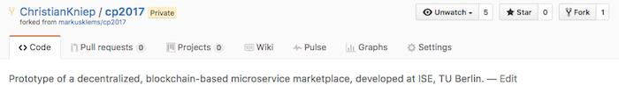

# Git Workflow

To allow collaboration on a shared git repository it is good practise to not work on the master branch of the upstream repository, but use a `branch` to do the actual work and submit a so call PullRequest to get it in the master branch of the upstream repository.

This can be done on the upstream repository itself (in our case `markusklems/cp2017`) or on a individual fork (which is done by using the `fork` button at the top of the aforementioned repository).

Once this is done one will be forwarded to the individual branch.



### Clone
```
➜  git $ git clone git@github.com:ChristianKniep/cp2017.git ~/src/github.com/ChristianKniep/cp2017
Cloning into '/Users/kniepbert/src/github.com/ChristianKniep/cp2017'...
remote: Counting objects: 7, done.
remote: Compressing objects: 100% (7/7), done.
remote: Total 7 (delta 0), reused 7 (delta 0), pack-reused 0
Receiving objects: 100% (7/7), done.
Checking connectivity... done.
➜  git $ cd cp2017
```

The individual repository is referenced by `origin`.

### Add remote repository

After cloning the repository one should create a `remote` repository be able to fetch upstream changes.

```
➜  cp2017 git:(master) $ git remote add upstream git@github.com:markusklems/cp2017.git
```

### Work on a feature branch

To not work on the master branch (which will be easier when creating a PullRequest), we create a (somewhat meaningfully named) `feature branch`.

```
➜  cp2017 git:(master) $ git checkout -b create_git_clone_howto 
Switched to a new branch 'create_git_clone_howto'
```
Now everything is set to actually do some work.

```
➜  cp2017 git:(create_git_clone_howto) $ <do some work>
```

### Push featurebranch 

After one figures that the work done so far deserves a break, one can create a commit.

```
➜  cp2017 git:(create_git_clone_howto) $ git status 
On branch create_git_clone_howto
Untracked files:
  (use "git add <file>..." to include in what will be committed)
 
	howto/
 
nothing added to commit but untracked files present (use "git add" to track)
➜  cp2017 git:(create_git_clone_howto) $ git add howto/
➜  cp2017 git:(create_git_clone_howto) $ git status
On branch create_git_clone_howto
Changes to be committed:
  (use "git reset HEAD <file>..." to unstage)

	new file:   howto/git.md
	new file:   howto/pics/git_fork.png
➜  cp2017 git:(create_git_clone_howto) $ git commit -m 'initial version of the git HowTo'
[create_git_clone_howto b028a7c] initial version of the git HowTo
 2 files changed, 46 insertions(+)
 create mode 100644 howto/git.md
 create mode 100644 howto/pics/git_fork.png
```

### Rebase the `feature branch`

**Important** To take other changes into account and one should always do a rebase against the `upstream master`.

```
➜  cp2017 git:(create_git_clone_howto) ✗ git pull --rebase upstream master
From github.com:markusklems/cp2017
 * branch            master     -> FETCH_HEAD
 * [new branch]      master     -> upstream/master
Current branch create_git_clone_howto is up to date.
```
In this case nothing changed, but better be safe then sorry... :)

### Push to origin
If this branch is now pushed to the individual repository...

```
➜  cp2017 git:(create_git_clone_howto) ✗ git push --set-upstream origin create_git_clone_howto
Counting objects: 6, done.
Delta compression using up to 4 threads.
Compressing objects: 100% (5/5), done.
Writing objects: 100% (6/6), 51.09 KiB | 0 bytes/s, done.
Total 6 (delta 0), reused 0 (delta 0)
To git@github.com:ChristianKniep/cp2017.git
 * [new branch]      create_git_clone_howto -> create_git_clone_howto
Branch create_git_clone_howto set up to track remote branch create_git_clone_howto from origin.
```

... it will automatically create a proposal to create a PR on the repositories (upstream and origin).


Once clicked it will create a PR, that can be peer-reviewed and subsequently merged to the `upstream master`.
