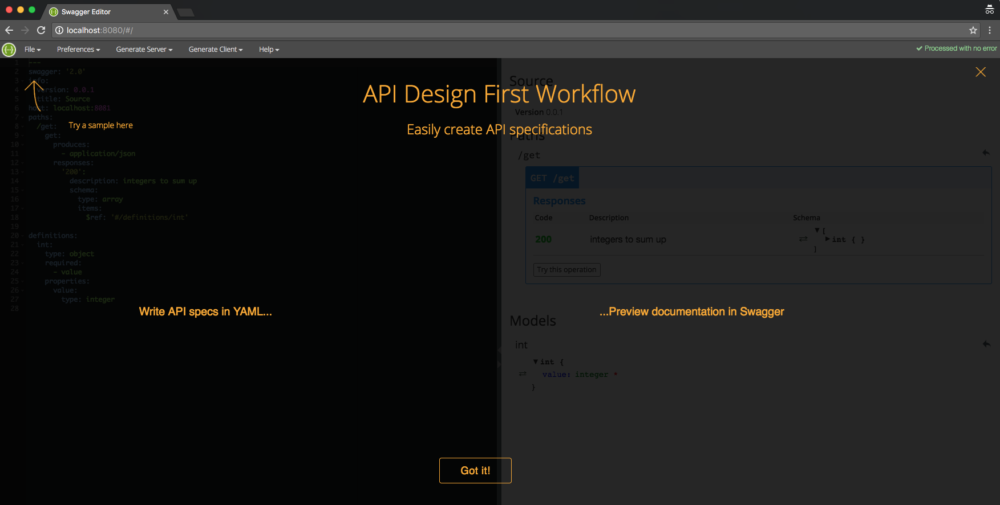
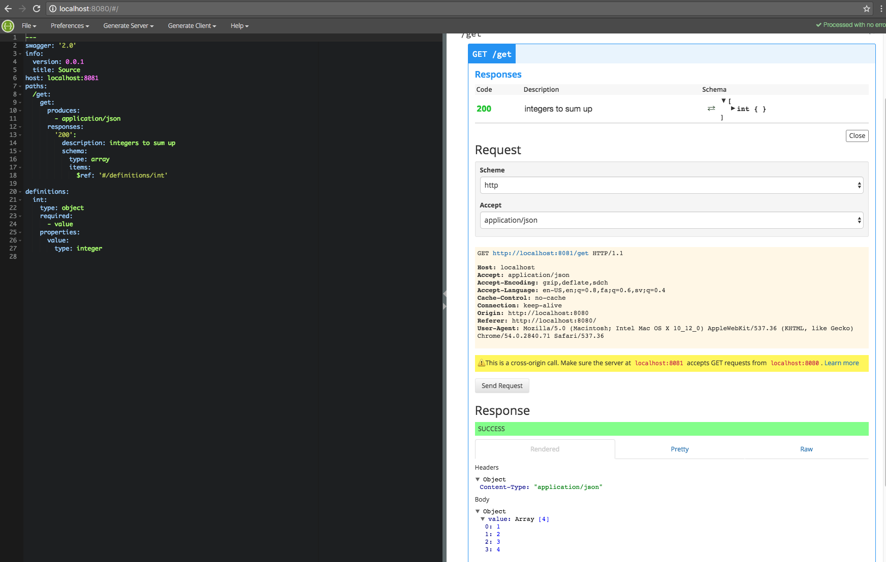
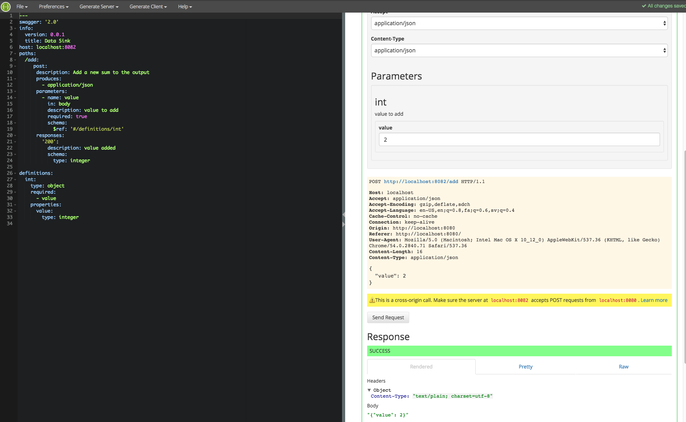
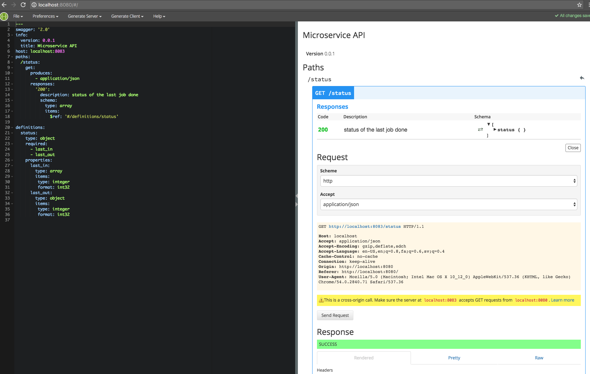

# API Contract Proof Of Concept

This little example spins up a little Contract stack, defined by the docker-compose file.

## Components

### Default

- **swagger-consul**: To clot everything together a `Consul` instance is started (might not be needed, have to thing about it).
- **swagger-editor**: An instance of Swagger-Editor. The config and the definitions are overwritten by the contents of the directory present in the `swagger-editor` directory.

### API endpoints

The API endpoints all use the same (simple) golang binary which presents a couple of endpoints.

##### in
The data source which provides the endpoint `GET :8081/get`, returning `{"value": [1,2,3,4] }`. 
##### out
An endpoint used by the microservice to push the result to: `POST :8082/add` which consumes `{"value": <int>}`.
##### microservice

This is going to be the container holding the microservice. When it spins up it should 

- connect to `:8081/get` to fetch the input
- calculate the result (in this case `10`)
- push it to the `:8082/add` output as json object

Furthermore the endpoint should provide an endpoint `GET :8083/status` which provides a health endpoint providing information what is has done and how it is doing in general.

## The Stack

Build the API

```
$ docker-compose build
Building microservice
Step 1 : FROM qnib/alpn-go-dev
*snip*
Successfully built 2ade2a57f0e4
swagger-consul uses an image, skipping
swagger-editor uses an image, skipping
Building out
Step 1 : FROM qnib/alpn-go-dev
*snip*
Successfully built 2ade2a57f0e4
Building in
Step 1 : FROM qnib/alpn-go-dev
*snip*
Successfully built 2ade2a57f0e4
$
```
Start the stack...

```
$ docker-compose up -d
Creating swagger-consul
Creating in
Creating swagger-editor
Creating out
Creating microservice
$ 
```

### Swagger Editor

To oversee the whole operation swagger-editor can be access via [localhost:8080](http://localhost:8080).



#### in.yml

The default definition is `in.yml`, by clicking on the right it will query the `/get` endpoint.



#### out.yml

When switching to the `out.yml` definition (top left `open example`), swagger can post to `/add`.
One has to provide a value...



#### microservice.yml

This definition queries the `/status` endpoint which returns a dummy response. It should be provided by the business-logic of the microservice itself.



