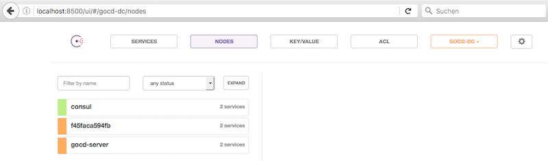

# GoCD 

## Docker Stack

To spin up the stack we are using a `docker-compose` file, which define the docker containers to be used.

```
$ cat docker-compose.yml
version: '2'
services:
  consul:
    image: qnib/alpn-consul
    hostname: consul
    container_name: consul
    networks:
     - gocd
    ports:
     - 8500:8500
    environment:
     - DC_NAME=gocd-dc
     - CONSUL_BOOTSTRAP=true

  gocd-server:
    hostname: gocd-server
    container_name: gocd-server
    image: qnib/gocd-server
    dns:
      - consul
      - 8.8.8.8
    networks:
     - gocd
    ports:
     - 8153:8153
    environment:
     - DC_NAME=gocd-dc
     - GOCD_SERVER_CLEAN_WORKSPACE=false
     - CONSUL_CLUSTER_IPS=consul
     - GOCD_AGENT_AUTOENABLE_KEY=cp2017
    volumes:
     - ./serverBackups/:/opt/go-server/artifacts/serverBackups/

  gocd-agent:
    image: qnib/alpn-gocd-agent
    networks:
     - gocd
    dns:
      - consul
      - 8.8.8.8
    environment:
     - DC_NAME=gocd-dc
     - GO_SERVER=gocd-server
     - GOCD_LOCAL_DOCKERENGINE=true
     - DOCKER_HOST=unix:///var/run/docker.sock
     - CONSUL_CLUSTER_IPS=consul
     - GOCD_AGENT_AUTOENABLE_KEY=cp2017
     - GOCD_AGENT_AUTOENABLE_ENV=latest,golang
    privileged: true

networks:
  gocd:
    driver: bridge
$
```

This will spin up consul (service registration, key-value store, DNS) one server and one agent.

```
$ docker-compose up -d
Creating network "gocd_gocd" with driver "bridge"
Creating gocd-server
Creating gocd_gocd-agent_1
Creating consul
$
```

A moment later one can access consul (just to see how the stack is doing) via [localhost:8500](http://localhost:8500).



After a couple of seconds (java-processes have to start... :) ), the stack will be green.


### GoCD first look

Now the gocd-server is reachable under [localhost:8153](http://localhost:8153).
In case the directory `serverBackup` contains now backups to restore from, it will look like this:


On the agent page, will find one agent that has registered itself.


This agent can be accessed via docker command. It will provide some tooling and a local docker-engine at hand:

```
$ docker exec -ti gocd_gocd-agent_1 bash
bash-4.3# docker version
Client:
 Version:      1.12.2
 API version:  1.24
 Go version:   go1.7.1
 Git commit:   v1.12.2
 Built:
 OS/Arch:      linux/amd64

Server:
 Version:      1.12.2
 API version:  1.24
 Go version:   go1.7.1
 Git commit:   v1.12.2
 Built:
 OS/Arch:      linux/amd64
bash-4.3# hostname
6fe5def464f0
bash-4.3# exit
$
```

### Restore Backup

If the backup is already filled (as it should be by the time you read this), you will see at least this pipeline.


By clicking on the yellow (or green if it is finished) bar, one can access the build step and the job in process.


